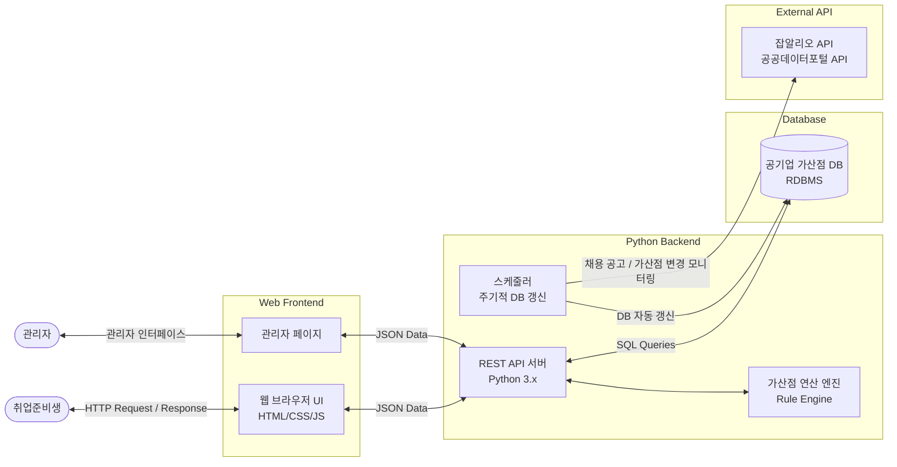
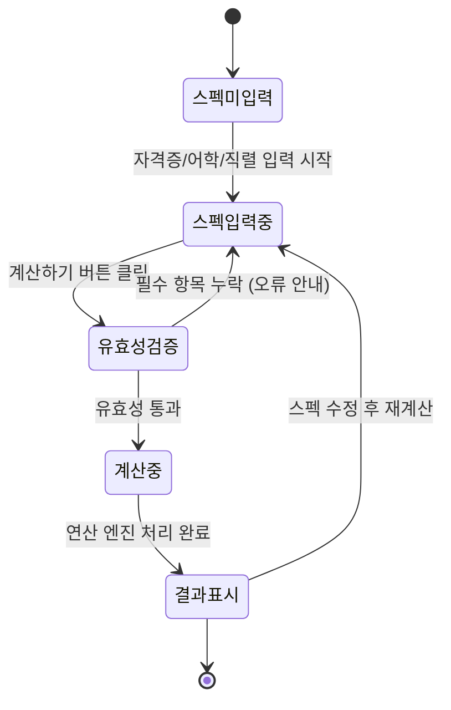
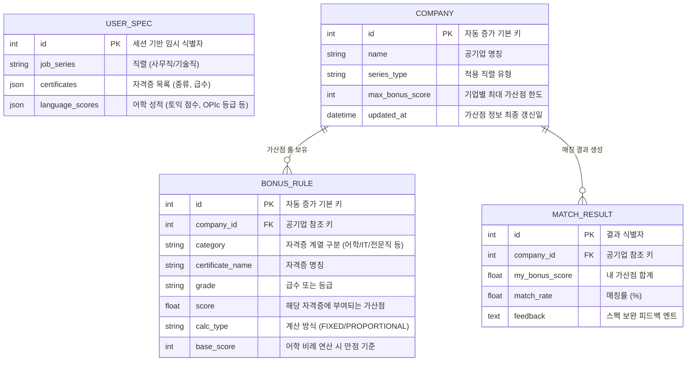

# 공기업 가산점 자동 계산 및 매칭 시스템 (Public Enterprise Bonus Score Matching System) - 통합 요구사항 명세서 (SRS)

본 문서는 `요구사항명세서.md`의 표준 구성 요소를 바탕으로 작성된 구체적인 '공기업 가산점 자동 계산 및 매칭 시스템'의 제품 요구사항 정의서(PRD)입니다.

---

## 1. 개요 (Introduction)

### 1.1 목적 (Purpose)
본 문서는 취업 준비생이 보유한 자격증·어학 스펙을 입력하면, 전국 공기업별 가산점을 자동으로 계산하고 매칭률 기반으로 최적 공기업을 추천해 주는 웹 시스템의 기능적/비기능적 요구사항을 정의합니다. 개발자, 디자이너, 기획자가 개발될 시스템의 상세 구조와 목표를 명확히 공유하는 것을 목적으로 합니다.

### 1.2 범위 (Scope)
- **In-scope**:
  - 사용자 스펙 입력 (자격증 종류·급수, 어학 점수/등급, 지원 직렬)
  - 공기업별 가산점 자동 계산 (합산 한도 룰, 중복 제거 룰, 어학 비례 연산 룰)
  - 매칭률 계산 및 내림차순 정렬 추천 화면
  - 스펙 보완 피드백 멘트 노출
  - 관리자 가산점 DB 업데이트 기능 (수동/자동)
- **Out-of-scope**:
  - 회원가입 / 로그인 / 개인 스펙 저장 (계정 기반 관리)
  - 실제 채용 지원 기능 (지원서 작성, 제출)
  - 합격/불합격 예측 AI 모델
  - 모바일 네이티브 앱 (iOS/Android)

### 1.3 용어 사전 (Glossary)
- **가산점(Bonus Score)**: 공기업 채용 시 자격증·어학 성적 보유자에게 필기/면접 점수에 추가로 부여하는 점수.
- **매칭률(Matching Rate)**: `[내 가산점 합계 / 해당 기업 최대 가산점] × 100(%)`으로 산출되는 비율.
- **합산 한도(Score Cap)**: 기업별로 정해진 가산점 상한선 (예: 최대 20점).
- **중복 제거(OR 룰)**: 동일 계열 자격증 중 가장 높은 등급 1개만 반영하는 로직.
- **어학 비례 연산**: `(유저 점수 / 만점 기준) × 배점`으로 어학 가산점을 계산하는 방식.
- **직렬(Job Series)**: 사무직(경영·회계·행정), 기술직(전기·기계·토목 등)으로 구분되는 지원 분야.

### 1.4 참고 문헌 (References)
- 공기업 요구사항.docx (초기 기획 요구사항 원문)
- 잡알리오(JOB ALIO) 공공 API 문서
- 공공데이터포털 API 가이드
- 표준 SRS 가이드 및 모델링 방법론 (`요구사항명세서.md`)

---

## 2. 시스템 컨텍스트 및 아키텍처 (System Context & Architecture)

### 2.1 시스템 사용자 / 이해관계자 (User Characteristics)

| 역할 | 설명 |
|---|---|
| **일반 사용자 (취준생)** | 자신의 스펙을 입력하고 공기업 가산점 매칭 결과를 조회하는 주 사용자 |
| **관리자** | 공기업 가산점 DB를 수동/자동으로 갱신하고 데이터 정합성을 유지하는 운영자 |

### 2.2 시스템 환경 제약사항 (Constraints)
- **운영 환경**: 웹 브라우저 기반 (PC/모바일 반응형), 별도 설치 불필요
- **개발 언어**: 백엔드는 Python 3.x 기반 (프레임워크 무관)
- **데이터 저장소**: PostgreSQL 또는 SQLite 등 RDBMS 사용 (영구 저장)
- **외부 API 연동**: 잡알리오(JOB ALIO) API 또는 공공데이터포털 API

### 2.3 시스템 아키텍처 다이어그램 (Architecture Diagram)



---

## 3. 기능적 요구사항 (Functional Requirements)

### 3.1 시스템 유스케이스 다이어그램 (Use-Case Diagram)

```mermaid
usecaseDiagram
    actor 취업준비생
    actor 관리자

    rectangle "공기업 가산점 매칭 시스템" {
        취업준비생 --> (자격증 입력)
        취업준비생 --> (어학 성적 입력)
        취업준비생 --> (직렬 선택)
        취업준비생 --> (가산점 매칭 결과 조회)
        취업준비생 --> (스펙 보완 피드백 확인)

        관리자 --> (공기업 가산점 DB 수동 업데이트)
        관리자 --> (외부 API 연동 자동 갱신 설정)
    }
```

### 3.2 핵심 비즈니스 로직 - 가산점 계산 시퀀스 다이어그램 (Sequence Diagram)

```mermaid
sequenceDiagram
    actor User as 취업준비생
    participant Frontend as 웹 UI
    participant Backend as Python 백엔드
    participant Engine as 가산점 연산 엔진
    database DB as 공기업 가산점 DB

    User->>Frontend: 자격증, 어학 성적, 직렬 입력 후 "계산하기" 클릭
    Frontend->>Backend: POST /api/calculate (스펙 데이터 전달)
    Backend->>DB: 직렬 필터링된 전체 공기업 가산점 룰 조회 (SELECT)
    DB-->>Backend: 기업별 가산점 룰 데이터 반환
    Backend->>Engine: 유저 스펙 + 기업별 룰 전달

    loop 기업별 반복 계산
        Engine->>Engine: OR 룰 적용 (동일 계열 자격증 중 최고 등급 1개만 선택)
        Engine->>Engine: 어학 비례 연산 (유저점수 / 만점기준 × 배점)
        Engine->>Engine: 합산 한도(Cap) 적용 후 최종 가산점 확정
        Engine->>Engine: 매칭률 = (내 가산점 / 기업 최대 가산점) × 100
    end

    Engine-->>Backend: 기업별 매칭률 + 보완 피드백 리스트 반환
    Backend-->>Frontend: 200 OK (매칭 결과 JSON)
    Frontend-->>User: 매칭률 내림차순 공기업 리스트 + 피드백 멘트 렌더링
```

### 3.3 가산점 계산 상태 머신 (State Machine Diagram)



### 3.4 기능별 상세 유스케이스 명세

#### [REQ-001] 자격증 입력
- 사용자는 자신이 보유한 자격증의 종류(컴퓨터활용능력, 한국사능력검정시험, 정보처리기사, 국어능력시험 등)와 급수(1급, 2급, 3급 등)를 드롭다운 또는 체크박스 형태의 UI로 선택할 수 있어야 합니다.
- 복수의 자격증을 동시에 등록할 수 있어야 합니다.

#### [REQ-002] 어학 성적 입력
- 토익(TOEIC) 점수(0~990), 토익스피킹 등급(Lv.1~8), OPIc 등급(NL~AL)을 입력받습니다.
- 정량적 점수와 등급 표기 방식을 모두 지원해야 합니다.

#### [REQ-003] 직렬 선택 및 필터링
- 사무직(경영/회계/행정), 기술직(전기/기계/토목 등) 중 하나를 선택하면, 해당 직렬과 무관한 공기업은 결과에서 제외됩니다.

#### [REQ-004] 가산점 연산 룰 엔진
- **합산 한도(Cap) 룰**: 자격증 가산점 합계가 기업별 공통 가점 최대 한도를 초과할 경우, 한도까지만 반영합니다.
- **중복 제거(OR) 룰**: 동일 계열 자격증이 복수 입력된 경우 가장 높은 등급 1개만 계산에 포함합니다.
- **어학 비례 연산 룰**: 기업이 비례 방식을 채택한 경우 `(유저 점수 / 만점 기준) × 배점` 공식으로 자동 계산합니다.

#### [REQ-005] 매칭률 계산 및 정렬
- 모든 공기업에 대해 `[내 가산점 / 해당 기업 최대 가산점] × 100` 비율을 산출합니다.
- 결과 화면에서 매칭률 내림차순(높은 순)으로 정렬하여 출력합니다.

#### [REQ-006] 스펙 보완 피드백
- 매칭률이 100% 미만인 기업에 대해 "OO 자격증을 추가하면 가산점 N점 상승", "토익 OOO점 이상 달성 시 만점 가능" 등 개인 맞춤형 가이드 멘트를 제공합니다.

#### [REQ-007] 관리자 DB 관리
- 잡알리오(JOB ALIO) API 또는 공공데이터포털 API를 연동하여 채용 공고 및 가산점 변경 사항을 주기적으로 모니터링합니다.
- 관리자는 수동 업데이트 또는 자동 갱신 스케줄 설정을 통해 DB를 최신 상태로 유지할 수 있어야 합니다.

---

## 4. 데이터 요구사항 (Data Requirements)

### 4.1 데이터 모델링 (ER Diagram)



### 4.2 데이터 사전 (Data Dictionary)

**COMPANY 테이블**
- `id` (Integer, PK): 공기업 고유 식별자
- `name` (String, Not Null): 공기업 명칭 (예: 한국전력공사, LH)
- `series_type` (String): 적용 직렬 ('사무직', '기술직', '공통')
- `max_bonus_score` (Integer, Not Null): 기업별 가산점 상한선
- `updated_at` (DateTime): 가산점 정보 최종 갱신 일시

**BONUS_RULE 테이블**
- `id` (Integer, PK): 룰 고유 식별자
- `company_id` (Integer, FK): 참조 공기업 ID
- `category` (String): 자격증 계열 구분 (중복 제거 OR 룰 적용 단위)
- `certificate_name` (String): 자격증 명칭
- `grade` (String): 자격증 급수 또는 어학 등급
- `score` (Float): 부여 가산점
- `calc_type` (Enum: `FIXED` / `PROPORTIONAL`): 고정 배점 또는 비례 연산 방식
- `base_score` (Integer): 비례 연산 시 만점 기준 (예: 토익 990)

---

## 5. 외부 인터페이스 명세 (External Interface Requirements)

### 5.1 사용자 인터페이스 (UX/UI) 및 화면 설계 (Wireframe)

#### [메인 화면 - 스펙 입력]
```text
+---------------------------------------------------------------+
|  🏢 공기업 가산점 매칭 시스템                                      |
|---------------------------------------------------------------|
|  STEP 1. 직렬 선택                                              |
|  [ 사무직 (경영/회계/행정) ]  [ 기술직 (전기/기계/토목) ]             |
|---------------------------------------------------------------|
|  STEP 2. 자격증 입력                          [+ 자격증 추가]     |
|  | 자격증 종류 ▼        | 급수 ▼  |  [삭제]  |                   |
|  | 컴퓨터활용능력        | 1급     |  [X]    |                   |
|  | 한국사능력검정시험    | 1급     |  [X]    |                   |
|---------------------------------------------------------------|
|  STEP 3. 어학 성적 입력                                         |
|  토익(TOEIC): [  850  ] 점    OPIc: [ IH ▼ ]                  |
|  토익스피킹:  [ Lv.6 ▼ ]                                        |
|---------------------------------------------------------------|
|                          [ 🔍 가산점 계산하기 ]                   |
+---------------------------------------------------------------+
```

#### [결과 화면 - 매칭 결과 및 피드백]
```text
+---------------------------------------------------------------+
|  📊 나의 공기업 가산점 매칭 결과 (사무직 기준)                        |
|---------------------------------------------------------------|
|  공기업명          | 내 가산점 | 최대 가산점 | 매칭률  | 피드백    |
|---------------------------------------------------------------|
|  한국전력공사      | 20점     | 20점       | 100%  | 만점 달성  |
|  국민건강보험공단  | 16점     | 20점       |  80%  | [피드백▼] |
|  LH한국토지공사    | 14점     | 20점       |  70%  | [피드백▼] |
|  ...               | ...      | ...        | ...   | ...       |
|---------------------------------------------------------------|
|  💡 피드백 예시: "토익 점수를 900점 이상 올리면 LH 만점 가능합니다."    |
+---------------------------------------------------------------+
```

#### [컴포넌트 상세 명세]
- **직렬 선택 버튼**: 토글 형태로 사무직/기술직 선택. 선택된 직렬과 무관한 공기업 필터링.
- **자격증 입력 행(Row)**: 드롭다운으로 자격증 종류·급수 선택. `[+ 자격증 추가]` 버튼으로 행 동적 추가.
- **어학 성적 입력**: 점수 입력 필드 + 등급 드롭다운 혼합.
- **결과 테이블**: 매칭률 기준 내림차순 정렬. 피드백 토글 확장 가능.
- **피드백 섹션**: 100% 미만 기업에 개인 맞춤형 스펙 보완 가이드 노출.

### 5.2 API (소프트웨어 인터페이스)

| Method | Endpoint | 설명 |
|---|---|---|
| `POST` | `/api/calculate` | 유저 스펙 입력, 전체 공기업 가산점 계산 및 매칭률 반환 |
| `GET` | `/api/companies` | 전체 공기업 목록 조회 (직렬 필터 파라미터: `?series=사무직`) |
| `GET` | `/api/companies/{id}/rules` | 특정 공기업의 가산점 룰 상세 조회 |
| `PUT` | `/api/admin/companies/{id}` | 관리자: 특정 공기업 가산점 정보 수동 업데이트 |
| `POST` | `/api/admin/sync` | 관리자: 외부 API(잡알리오 등) 연동 DB 동기화 트리거 |

**POST /api/calculate 요청 예시:**
```json
{
  "job_series": "사무직",
  "certificates": [
    { "name": "컴퓨터활용능력", "grade": "1급" },
    { "name": "한국사능력검정시험", "grade": "1급" }
  ],
  "language_scores": {
    "toeic": 850,
    "opic": "IH"
  }
}
```

**POST /api/calculate 응답 예시:**
```json
{
  "results": [
    {
      "company_id": 1,
      "company_name": "한국전력공사",
      "my_bonus_score": 20,
      "max_bonus_score": 20,
      "match_rate": 100.0,
      "feedback": null
    },
    {
      "company_id": 2,
      "company_name": "LH한국토지공사",
      "my_bonus_score": 14,
      "max_bonus_score": 20,
      "match_rate": 70.0,
      "feedback": "토익 점수를 900점 이상 올리면 LH 만점 가능합니다."
    }
  ]
}
```

### 5.3 외부 API 연동
- **잡알리오(JOB ALIO) API**: 공기업 채용 공고 및 자격 요건 정보 수집
- **공공데이터포털 API**: 가산점 변경 사항 모니터링

---

## 6. 비기능적 요구사항 (Non-functional Requirements)

### 6.1 성능 (Performance)
- 가산점 계산 요청 응답 시간은 2초 이내를 목표로 합니다.
- `BONUS_RULE` 테이블의 `company_id`, `category` 컬럼에 인덱스를 적용하여 기업별 룰 조회 성능을 보장합니다.

### 6.2 보안 (Security)
- 모든 DB 조작 쿼리는 파라미터화 쿼리(Parameterized Query) 또는 ORM을 사용하여 SQL Injection을 차단합니다.
- 관리자 기능(`/api/admin/*`)은 별도 인증 토큰(JWT 등) 기반으로 접근을 제한합니다.

### 6.3 신뢰성 (Reliability)
- 유저가 필수 항목(직렬, 스펙)을 누락한 채 계산 요청 시, 프론트엔드와 백엔드 양쪽에서 유효성 검증(Validation)을 수행합니다.
- 외부 API(잡알리오 등) 연동 실패 시, 기존 DB 데이터를 유지한 채 오류 로그만 기록하고 시스템이 중단되지 않아야 합니다.
- 연산 엔진 처리 중 예외 발생 시 Python 프로세스가 크래시(Crash)되지 않도록 예외 핸들링을 필수 적용합니다.

### 6.4 유지보수성 (Maintainability)
- 가산점 룰(합산 한도, OR 룰, 비례 연산)은 코드에 하드코딩하지 않고, DB의 `BONUS_RULE` 테이블에서 동적으로 로드하여 룰 변경 시 코드 수정 없이 DB만 업데이트하면 되는 구조로 설계합니다.
- 외부 API 연동 모듈은 별도 레이어로 분리하여 API 변경 시 영향 범위를 최소화합니다.

---

## 7. 부록 (Appendices)

### 7.1 요구사항 추적 매트릭스 (RTM)

| Reqs ID | 항목 | 참조 다이어그램 | 개발 상태 |
|---|---|---|---|
| REQ-001 | 자격증 종류·급수 입력 UI | 유스케이스 다이어그램 | 미구현 |
| REQ-002 | 어학 성적 정량 입력 | 유스케이스 다이어그램 | 미구현 |
| REQ-003 | 직렬 선택 및 공기업 필터링 | 아키텍처 플로우 | 미구현 |
| REQ-004 | 가산점 연산 룰 엔진 (합산/OR/비례) | 시퀀스 다이어그램, 상태 머신 | 미구현 |
| REQ-005 | 매칭률 계산 및 내림차순 정렬 | 시퀀스 다이어그램 | 미구현 |
| REQ-006 | 스펙 보완 개인 맞춤 피드백 | 유스케이스 다이어그램 | 미구현 |
| REQ-007 | 관리자 DB 수동/자동 갱신 기능 | 아키텍처 다이어그램 | 미구현 |