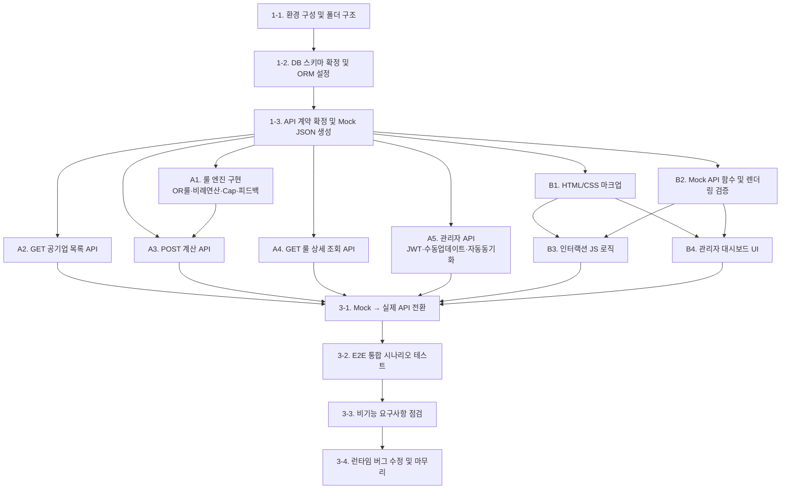

# 공기업 가산점 자동 계산 및 매칭 시스템 - 개발 세부 작업 목록 (TASK) 및 병렬 개발 전략

본 문서는 `PRD.md` 및 `요구사항명세서.md`를 기반으로 인공지능 에이전트와 **병렬적(Parallel)으로 소프트웨어를 극도로 효율적으로 개발하기 위해** 작업(Task)의 종속성과 독립성을 구분하여 재구성된 계획표입니다.

> **참조 문서**: `PRD.md` · `요구사항명세서.md`  
> **REQ 추적**: REQ-001 ~ REQ-008 (SRS RTM 기준)

---

## 📌 Phase 1: 뼈대 설계 및 계약 확정 (Sequential - 직렬 필수)

**모든 병렬 작업의 기준점이 되는 가장 중요한 '종속적' 단계입니다. 이 단계가 완료되어야만 이후 Track A(백엔드)와 Track B(프론트엔드)를 동시에 위임할 수 있습니다.**

---

### 1-1. 프로젝트 초기 환경 구성
> 참조: `PRD 2.2 시스템 환경 제약사항`, `SRS 2.2 Constraints`

- [ ] Python 3.x 가상환경(venv) 생성 및 의존성 패키지 초기화 (`requirements.txt` 작성)
- [ ] 프레임워크 선택 및 초기화 (Flask / FastAPI / Django 중 택1, 이후 전 작업의 기준)
- [ ] 프로젝트 폴더 구조 확정 및 생성

```
project/
├── backend/
│   ├── app/
│   │   ├── api/          # REST API 라우터
│   │   ├── engine/       # 가산점 룰 연산 엔진 (독립 모듈)
│   │   ├── models/       # DB ORM 모델
│   │   ├── services/     # 비즈니스 로직
│   │   └── external/     # 외부 API 연동 레이어 (잡알리오 등)
│   ├── tests/
│   └── main.py
├── frontend/
│   ├── index.html
│   ├── css/
│   └── js/
└── .env.example
```

---

### 1-2. 데이터베이스 스키마 확정 및 ORM 설정
> 참조: `PRD 4.1 ER Diagram`, `SRS 4.1~4.2 데이터 사전`

- [ ] DB 선택 확정: SQLite(개발용) / PostgreSQL(운영용) 구분 환경 설정 (`.env` 기반)
- [ ] ORM 모델 정의 및 마이그레이션 스크립트 작성

  **생성 대상 테이블 3종:**
  - `COMPANY` — `id`, `name`(UNIQUE), `series_type`, `max_bonus_score`, `is_active`, `updated_at`
  - `BONUS_RULE` — `id`, `company_id`(FK), `category`, `certificate_name`, `grade`, `score`, `calc_type`(ENUM: FIXED/PROPORTIONAL), `base_score`, `series_filter`
  - `ADMIN_LOG` — `id`, `company_id`(FK), `action`, `changed_by`, `detail`, `created_at`

- [ ] 성능 인덱스 적용: `BONUS_RULE.company_id`, `BONUS_RULE.category`, `COMPANY.series_type`
- [ ] 공기업 샘플 시드 데이터(Seed Data) 5~10개 삽입 스크립트 작성 (이후 Track A/B 로컬 테스트 기준점)

---

### 1-3. **[가장 중요] 프론트엔드-백엔드 간 API 계약(Contract) 문서 확정**
> 참조: `PRD 5.2 API 인터페이스`, `SRS 5.2 소프트웨어 API 인터페이스`

**이 단계에서 확정된 API 명세가 Track A(백엔드 구현)와 Track B(프론트엔드 Mock) 양쪽의 기준점이 됩니다.**

- [ ] 아래 5개 엔드포인트의 URL 경로, Request/Response JSON 스펙, HTTP 상태 코드 최종 확정

  | Method | Endpoint | 인증 | 핵심 확정 사항 |
  |---|---|---|---|
  | `POST` | `/api/calculate` | 불필요 | Request 필드명·타입, Response 배열 구조, 오류 코드(400/422/500) |
  | `GET` | `/api/companies` | 불필요 | `?series=` 쿼리 파라미터 동작 방식 |
  | `GET` | `/api/companies/{id}/rules` | 불필요 | 룰 목록 JSON 구조 |
  | `PUT` | `/api/admin/companies/{id}` | JWT 필수 | 수정 가능 필드 범위 확정 |
  | `POST` | `/api/admin/sync` | JWT 필수 | 동기화 트리거 응답 구조 |

- [ ] Mock JSON 응답 파일 생성 (`/frontend/js/mock/`) — Track B가 이 파일을 기반으로 선행 개발

---

## 🚀 Phase 2: 실제 기능 개발 (Parallel - 병렬 독립 가능)

Phase 1에서 확정된 **API 명세와 DB 스키마라는 '계약(Contract)'** 이 성립되었으므로, Track A(백엔드)와 Track B(프론트엔드) 작업을 서로의 완성을 기다릴 필요 없이 독립적으로 동시 개발할 수 있습니다.

---

### 🔨 Track A: 백엔드 API & 연산 엔진 (독립 진행)

#### 2-A1. 가산점 연산 룰 엔진 구현
> 참조: `PRD REQ-004`, `SRS UC-004`, `SRS 7.2 룰 엔진 동작 예`  
> ⚠️ **Track A에서 가장 핵심이 되는 독립 모듈** — 다른 A 작업들이 이 엔진을 호출하는 구조

- [ ] `engine/rule_engine.py` 독립 모듈로 분리 생성
- [ ] **OR 룰** 구현: 동일 `category` 내 자격증 복수 입력 시 `score` 최고값 1개만 선택
- [ ] **PROPORTIONAL 어학 비례 연산** 구현: `(유저 점수 / base_score) × score` 공식
- [ ] **합산 한도(Cap) 룰** 구현: 기업별 `max_bonus_score` 초과 시 절삭 처리
- [ ] **매칭률 계산**: `(내 가산점 합계 / max_bonus_score) × 100` 반올림 처리
- [ ] **피드백 멘트 생성 로직**: 매칭률 100% 미만 기업 대상, 부족 항목 분석 후 문자열 생성
- [ ] 룰 엔진 단위 테스트 작성 (SRS 7.2 예시 케이스 기반 — OR 룰 적용, 비례 연산, Cap 절삭 시나리오)

---

#### 2-A2. [GET] 공기업 목록 조회 API 구현
> 참조: `PRD REQ-003`, `SRS UC-001`, `GET /api/companies`

- [ ] `GET /api/companies` 라우터 구현
- [ ] `?series=사무직` 또는 `?series=기술직` 쿼리 파라미터로 `COMPANY.series_type` 필터링
- [ ] `is_active = TRUE` 조건으로 채용 중단 기업 자동 제외
- [ ] Response: 기업 id, name, series_type, max_bonus_score 목록 반환
- [ ] DB 시드 데이터 기반 직접 호출 테스트 (curl 또는 Postman)

---

#### 2-A3. [POST] 가산점 계산 API 구현
> 참조: `PRD REQ-001~005`, `SRS UC-002~005`, `POST /api/calculate`

- [ ] `POST /api/calculate` 라우터 구현
- [ ] **백엔드 유효성 검증** (SRS 6.3):
  - `job_series` 필수값 누락 → 400 반환
  - 토익 점수 0~990 범위 초과 → 422 반환
  - 자격증 `grade` 누락 → 400 반환
- [ ] DB에서 직렬 필터링된 전체 공기업 `BONUS_RULE` 조회 (SQL 인덱스 활용)
- [ ] 2-A1에서 구현한 룰 엔진 호출 → 기업별 결과 수집
- [ ] 개별 기업 계산 중 예외 발생 시 해당 기업 스킵 후 나머지 반환 (try-except, SRS 6.3)
- [ ] 매칭률 내림차순 정렬 후 Response JSON 반환
- [ ] 파라미터화 쿼리 또는 ORM 적용 확인 (SQL Injection 방지, SRS 6.2)
- [ ] 전역 예외 핸들러 등록 → 500 응답 반환 (Python 프로세스 크래시 방지)

---

#### 2-A4. [GET] 공기업 가산점 룰 상세 조회 API 구현
> 참조: `GET /api/companies/{id}/rules`

- [ ] `GET /api/companies/{id}/rules` 라우터 구현
- [ ] 존재하지 않는 `id` 요청 시 404 반환
- [ ] 해당 기업의 `BONUS_RULE` 전체 목록 JSON 반환

---

#### 2-A5. 관리자 API 구현 (JWT 인증 + DB 수동 업데이트 + 자동 동기화)
> 참조: `PRD REQ-007`, `SRS UC-007~008`, `PUT /api/admin/companies/{id}`, `POST /api/admin/sync`

- [ ] **JWT 인증 미들웨어** 구현: `/api/admin/*` 경로 전체 보호, 토큰 만료 시 401 반환
- [ ] `PUT /api/admin/companies/{id}` 라우터 구현
  - 수정 가능 필드: `max_bonus_score`, `series_type`, `is_active`, 하위 `BONUS_RULE` 항목
  - `ADMIN_LOG` 테이블에 변경 이력 자동 기록 (`action: MANUAL_UPDATE`)
- [ ] `POST /api/admin/sync` 라우터 구현
  - 잡알리오 API 또는 공공데이터포털 API 호출 (외부 API 레이어 `/external/` 모듈 분리)
  - API 호출 실패 시 오류 로그 기록 후 기존 DB 유지, 시스템 중단 없음 (SRS 6.3)
  - 동기화 성공 시 `ADMIN_LOG` 기록 (`action: AUTO_SYNC`)
- [ ] 환경 변수(`.env`)에서 외부 API 키 로드 — 소스코드 하드코딩 절대 금지 (SRS 6.2)

---

### 🎨 Track B: 프론트엔드 UI/UX (독립 진행)

#### 2-B1. 화면 마크업(HTML/CSS) 구축
> 참조: `PRD 5.1 와이어프레임`, `SRS 5.1 화면 컴포넌트 명세`

- [ ] **메인 화면 (스펙 입력 폼)** 마크업
  - STEP 1: 직렬 선택 토글 버튼 (사무직 / 기술직) — 선택 시 강조 스타일 적용
  - STEP 2: 자격증 입력 테이블 — 드롭다운(종류·급수) + `[+ 자격증 추가]` 동적 행 추가 + `[X]` 삭제 버튼
  - STEP 3: 어학 성적 입력 — 토익 숫자 입력 필드(0~990) + 토익스피킹·OPIc 등급 드롭다운
  - `[🔍 가산점 계산하기]` CTA 버튼
- [ ] **결과 화면** 마크업
  - 공기업명 / 내 가산점 / 최대 가산점 / 매칭률 / 상태 컬럼 테이블
  - 100% 기업 ✅ 만점 뱃지 스타일
  - 100% 미만 기업 `[피드백▼]` 토글 접기/펼치기 영역
  - `[← 스펙 수정하기]` 버튼 (입력 폼 복귀, 입력값 유지)
- [ ] **반응형(Responsive)** CSS 적용 (PC / 모바일 공통 지원, SRS 2.2)
- [ ] **오류 Toast 컴포넌트** — 우측 상단 표시, 3초 후 자동 소멸

---

#### 2-B2. Mock API 함수 작성 및 화면 렌더링 검증
> 참조: Phase 1-3에서 확정된 Mock JSON 파일 활용  
> 백엔드가 미완성이더라도 Phase 1에서 확정된 Mock 응답으로 프론트 선행 개발 가능

- [ ] `js/api.js` 파일 생성: 실제 API 호출 함수 껍데기 + Mock 응답 반환 더미 함수 분리 구조로 작성

  ```javascript
  // api.js 구조 예시
  const USE_MOCK = true; // Phase 3 통합 시 false로 전환

  async function calculateBonusScore(specData) {
    if (USE_MOCK) return mockCalculateResponse; // Mock JSON 반환
    return await fetch('/api/calculate', { method: 'POST', body: JSON.stringify(specData) });
  }
  ```

- [ ] Mock JSON 기반으로 결과 테이블 렌더링 동작 검증
- [ ] 매칭률 내림차순 정렬 렌더링 확인

---

#### 2-B3. 프론트엔드 인터랙션 JS 로직 구현
> 참조: `SRS UC-001~006`, `SRS 5.1 화면 컴포넌트 명세`

- [ ] **직렬 선택** 토글 상태 관리 (선택 값 전역 변수 저장)
- [ ] **자격증 입력 행 동적 추가/삭제** — `[+ 자격증 추가]` 클릭 시 빈 행 DOM 추가, `[X]` 클릭 시 해당 행 제거
- [ ] **프론트엔드 유효성 검증** (SRS 6.3) — 계산하기 버튼 클릭 시:
  - 직렬 미선택 → 인라인 오류 메시지 표시
  - 자격증 종류만 선택하고 급수 미선택 → 해당 행 오류 표시
  - 토익 점수 0~990 범위 초과 → 입력 필드 오류 표시
- [ ] **계산하기 버튼** 클릭 시 로딩 스피너 표시 (비동기 UX)
- [ ] **피드백 토글** 클릭 시 해당 기업 행 아래 피드백 멘트 펼침/접힘 동작
- [ ] **스펙 수정하기** 클릭 시 결과 화면 → 입력 폼 복귀 (입력값 유지)
- [ ] **오류 Toast** 표시 함수 구현 (서버 오류 5xx 발생 시 호출)

---

#### 2-B4. 관리자 대시보드 UI 구현
> 참조: `SRS UC-007~008`, `PUT /api/admin/companies/{id}`, `POST /api/admin/sync`

- [ ] 관리자 전용 페이지 (`/admin`) 마크업 (JWT 미인증 접근 시 리다이렉트 처리)
- [ ] 공기업 목록 테이블 + 각 기업별 `[수정]` 버튼
- [ ] 가산점 룰 수정 폼 (기업 선택 후 `BONUS_RULE` 항목 수정 UI)
- [ ] `[DB 동기화 실행]` 버튼 → `POST /api/admin/sync` 호출 및 결과 메시지 표시
- [ ] Mock 함수 기반 동작 검증 (Track A 2-A5 완료 전 선행 진행)

---

## 🧩 Phase 3: 통합 및 E2E 검증 (Sequential - 직렬 필수)

Track A(백엔드)와 Track B(프론트엔드)에서 독립적으로 개발·자체 검증이 완료된 코드를 연결하고 조립하는 종속적 단계입니다.

---

### 3-1. Mock → 실제 API 연동 전환
> Track B의 `USE_MOCK = true` → `false` 전환 및 네트워크 호출 연결

- [ ] `js/api.js`의 `USE_MOCK` 플래그를 `false`로 전환
- [ ] CORS 설정 확인 — 프론트 도메인에서 백엔드 `http://localhost:{PORT}/api/` 호출 허용
- [ ] `POST /api/calculate` 실제 호출 후 응답 JSON 구조가 Mock과 동일한지 확인
- [ ] `GET /api/companies` 실제 DB 데이터 반환 확인
- [ ] 관리자 `PUT /api/admin/companies/{id}` JWT 토큰 헤더 포함 호출 테스트

---

### 3-2. E2E 통합 시나리오 테스트
> 참조: `SRS RTM REQ-001~008` 전체 커버리지

아래 전체 플로우를 순서대로 실제 브라우저에서 시뮬레이션합니다.

- [ ] **시나리오 1 — 정상 계산 플로우**
  1. 직렬 선택 (사무직) → 자격증 2개 입력 → 토익 점수 입력 → 계산하기 클릭
  2. 결과 테이블 매칭률 내림차순 정렬 확인
  3. 100% 기업에 ✅ 만점 뱃지 표시 확인
  4. 100% 미만 기업 피드백 토글 펼침/접힘 확인

- [ ] **시나리오 2 — OR 룰 검증**
  1. 컴퓨터활용능력 1급·2급 동시 입력 후 계산
  2. 계산 결과에서 1급 기준으로만 가산점 반영 확인 (2급 중복 제거)

- [ ] **시나리오 3 — 프론트 유효성 검증**
  1. 직렬 미선택 상태로 계산하기 클릭 → 오류 메시지 표시 확인
  2. 토익 점수 9999 입력 → 범위 오류 표시 확인
  3. 자격증 종류 선택 후 급수 미선택 → 오류 표시 확인

- [ ] **시나리오 4 — 백엔드 유효성 검증 (API 직접 호출)**
  1. `job_series` 누락 요청 → 400 응답 확인
  2. `toeic: 9999` 요청 → 422 응답 확인

- [ ] **시나리오 5 — 관리자 기능**
  1. JWT 없이 `/api/admin/*` 접근 → 401 반환 확인
  2. JWT 포함 공기업 가산점 수정 → DB 반영 확인 → ADMIN_LOG 기록 확인
  3. DB 동기화 트리거 → 외부 API 호출 실패 시 시스템 중단 없이 오류 로그만 기록 확인

- [ ] **시나리오 6 — 스펙 수정 후 재계산**
  1. 결과 화면에서 `[← 스펙 수정하기]` 클릭 → 기존 입력값 유지 상태로 복귀
  2. 스펙 수정 후 재계산 → 새 결과 반영 확인

---

### 3-3. 비기능 요구사항 점검
> 참조: `SRS 6장 비기능적 요구사항`

- [ ] **성능**: `POST /api/calculate` 응답 시간 2초 이내 확인 (공기업 10개 이상 샘플 기준)
- [ ] **보안**: DB 쿼리 전체 파라미터화 쿼리 또는 ORM 적용 여부 코드 리뷰
- [ ] **보안**: `.env` 파일에서 외부 API 키 로드 확인 — 소스코드 하드코딩 없음 확인
- [ ] **신뢰성**: 룰 엔진 내 개별 기업 예외 발생 시 해당 기업만 스킵, 나머지 정상 반환 확인
- [ ] **신뢰성**: 전역 예외 핸들러 동작 확인 — Python 프로세스 크래시 없이 500 응답 반환
- [ ] **유지보수성**: 가산점 룰 DB에서 동적 로드 확인 — BONUS_RULE 수정 후 코드 변경 없이 결과 반영

---

### 3-4. 최종 런타임 버그 수정 및 마무리
- [ ] 프론트/백 통합 후 발생하는 런타임 오류 (null 값, 타입 불일치, CORS 등) 수정
- [ ] 전체 화면 반응형 레이아웃 최종 점검 (PC / 모바일)
- [ ] 오류 Toast 메시지 전체 케이스 표시 확인
- [ ] `요구사항명세서.md` RTM 표 개발 상태 컬럼 `미구현 → 구현완료` 업데이트

---

## 📊 작업 의존성 요약 다이어그램



---

## 📋 REQ 추적 매트릭스 (Task ↔ REQ 연결)

| REQ ID | 요구사항 항목 | 담당 Track | 관련 Task | 개발 상태 |
|---|---|---|---|---|
| REQ-001 | 직렬 선택 및 공기업 필터링 | A + B | 2-A2, 2-B1, 2-B3 | 미구현 |
| REQ-002 | 자격증 종류·급수 입력 UI | B | 2-B1, 2-B3 | 미구현 |
| REQ-003 | 어학 성적 정량 입력 | B | 2-B1, 2-B3 | 미구현 |
| REQ-004 | 가산점 연산 룰 엔진 (OR/비례/Cap) | A | 2-A1, 2-A3 | 미구현 |
| REQ-005 | 매칭률 계산 및 내림차순 정렬 | A + B | 2-A1, 2-A3, 2-B2, 2-B3 | 미구현 |
| REQ-006 | 스펙 보완 개인 맞춤 피드백 | A + B | 2-A1, 2-A3, 2-B3 | 미구현 |
| REQ-007 | 관리자 DB 수동 업데이트 | A + B | 2-A5, 2-B4 | 미구현 |
| REQ-008 | 외부 API 자동 동기화 | A | 2-A5 | 미구현 |