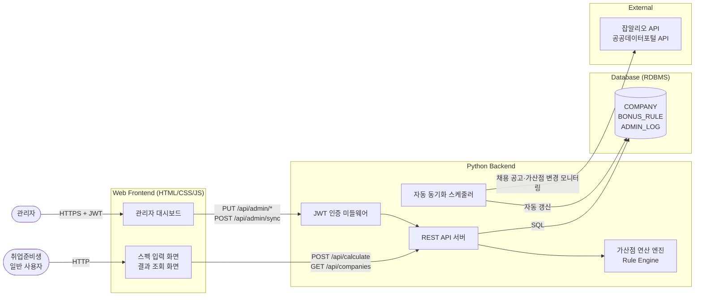
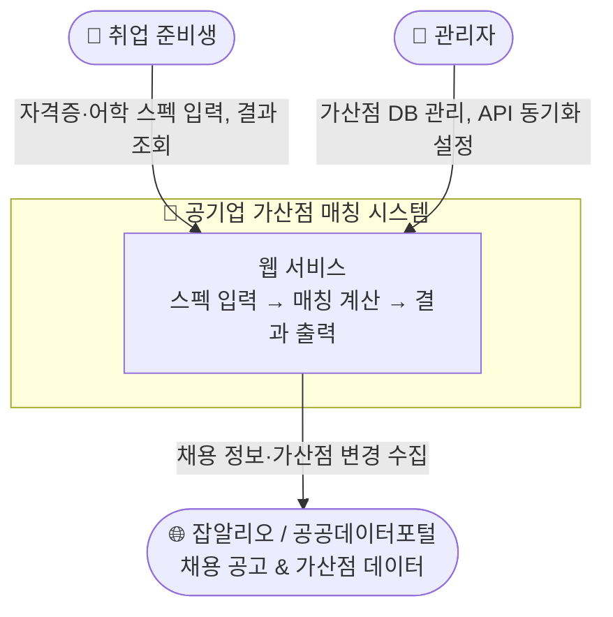
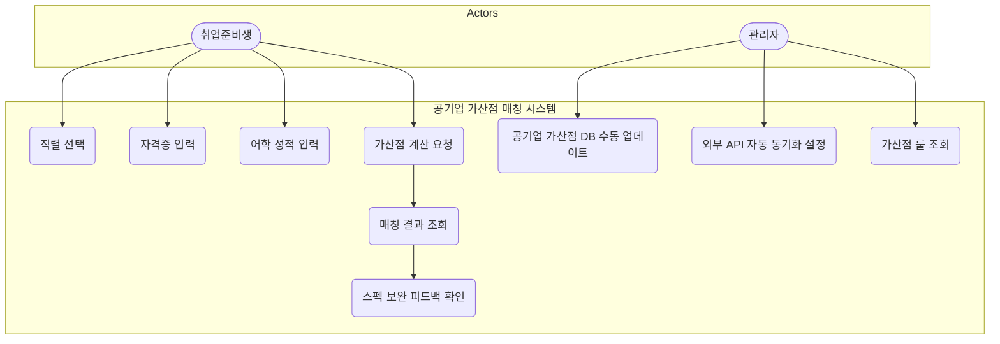
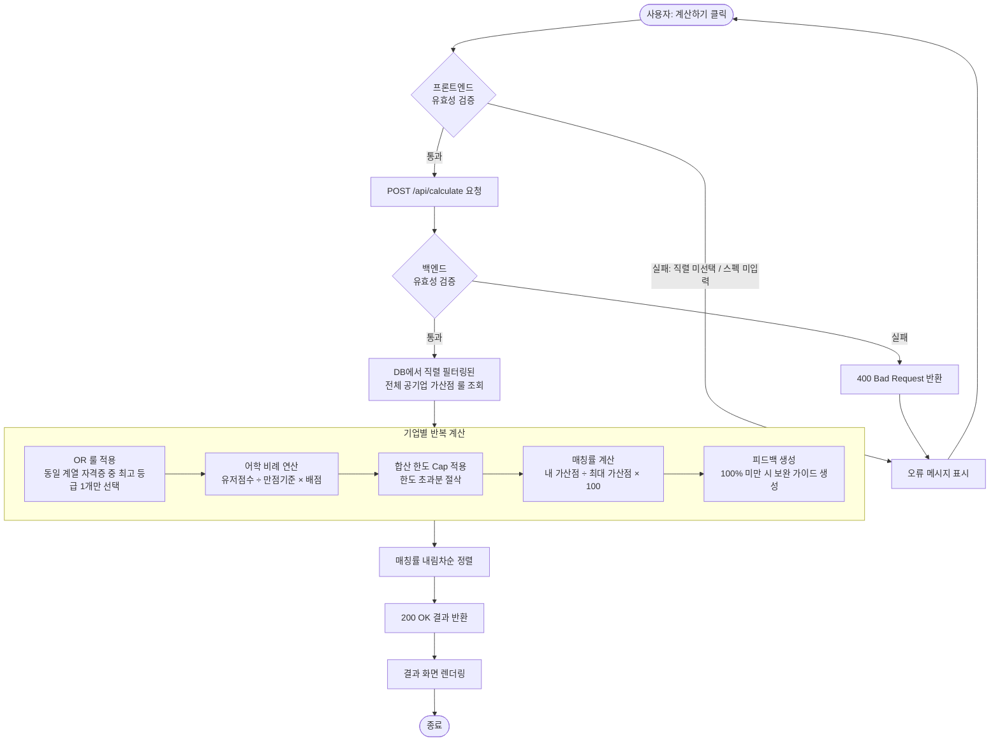
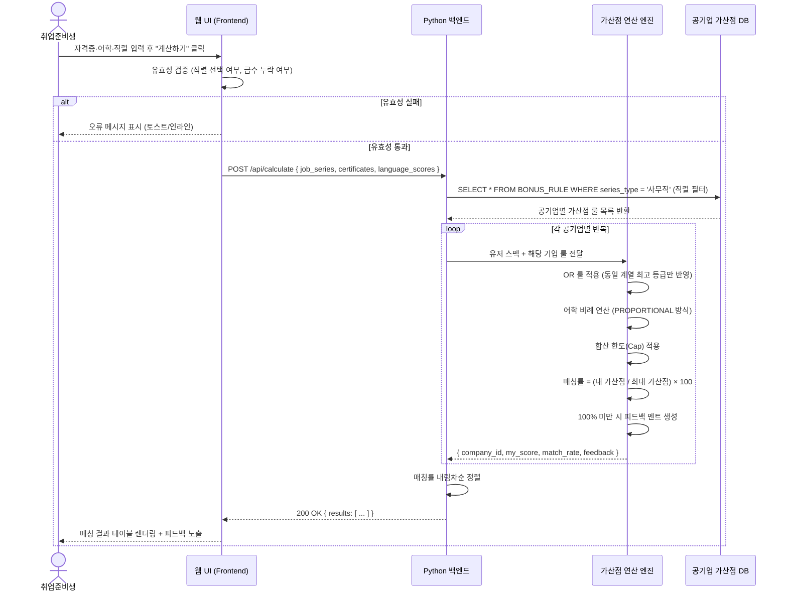
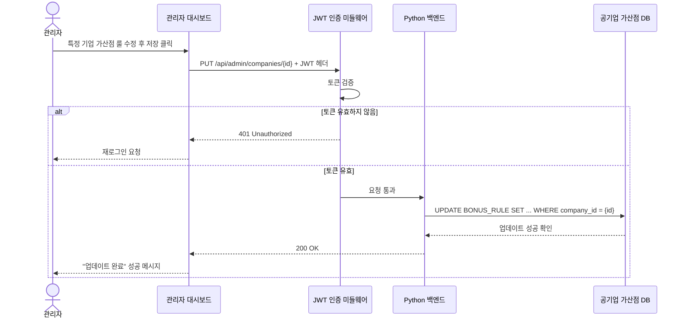
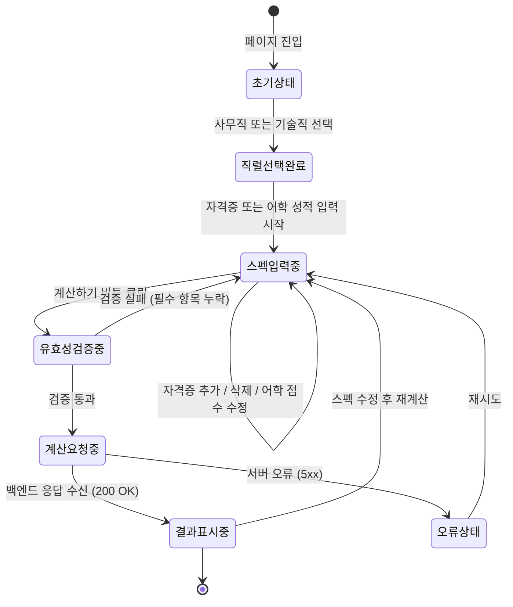
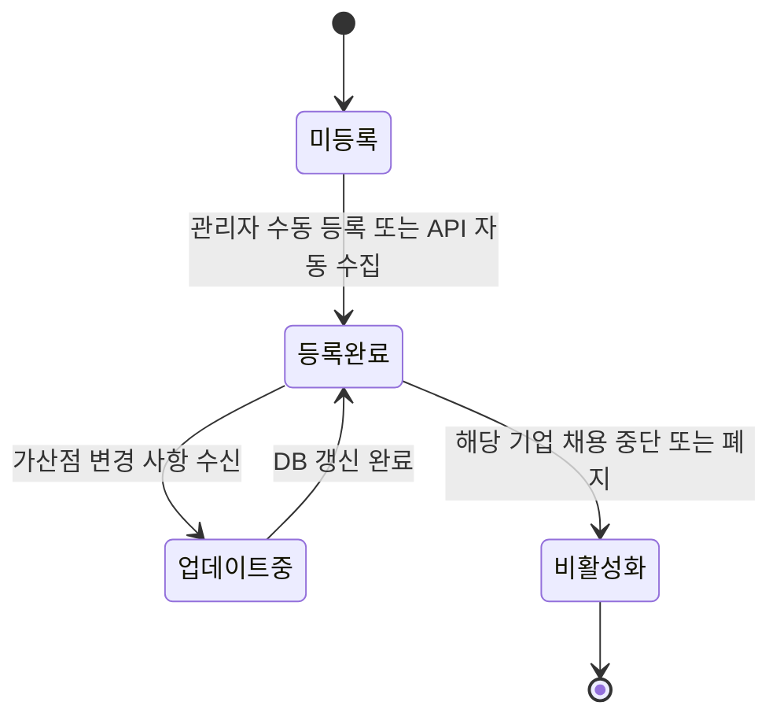
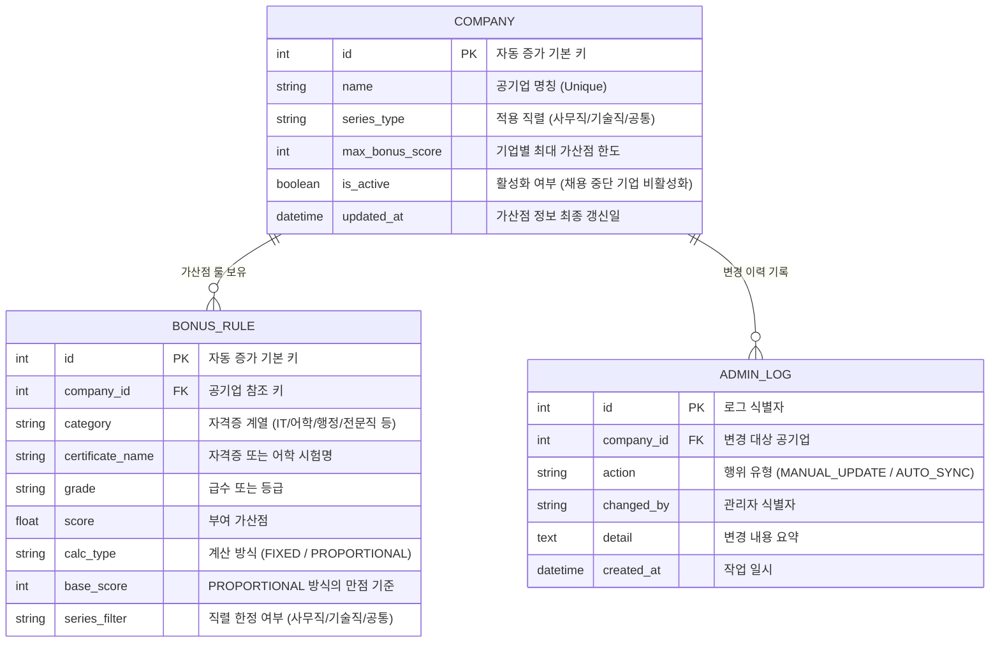
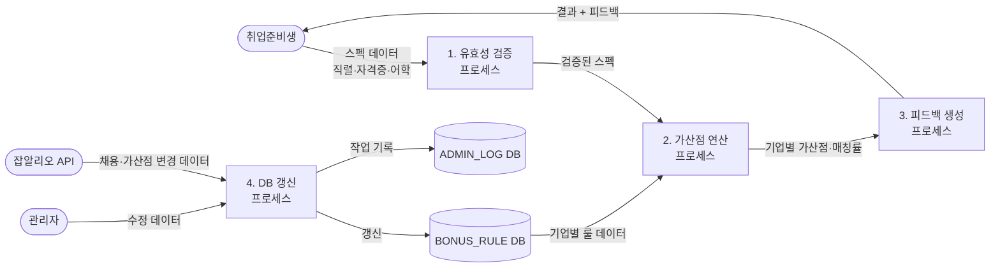

# 📋 공기업 가산점 자동 계산 및 매칭 시스템 - 소프트웨어 요구사항 명세서 (SRS)

> **문서 버전**: v1.0  
> **작성 기준**: PRD.md (공기업 가산점 자동 계산 및 매칭 시스템)  
> **작성일**: 2026-05-27

---

## 1. 개요 (Introduction)

### 1.1 목적 (Purpose)
본 문서는 **공기업 가산점 자동 계산 및 매칭 시스템**의 소프트웨어 요구사항 명세서(SRS)입니다.  
취업 준비생이 보유한 자격증·어학 스펙을 입력하면, 전국 공기업별 가산점을 자동으로 계산하고 매칭률 기반으로 최적 공기업 리스트를 추천해 주는 웹 시스템의 기능적·비기능적 요구사항 전체를 체계적으로 정의합니다.

본 문서의 독자는 다음과 같습니다.

| 독자 | 활용 목적 |
|---|---|
| 백엔드 개발자 | API 설계, 연산 엔진 구현, DB 스키마 구성 기준 |
| 프론트엔드 개발자 | 화면 컴포넌트 설계 및 API 연동 기준 |
| 기획자 / PM | 기능 범위 확정 및 우선순위 조정 기준 |
| QA 엔지니어 | 테스트 케이스 설계 및 검증 기준 |
| 관리자 (운영자) | 데이터 관리 기능 범위 및 운영 정책 파악 |

### 1.2 범위 (Scope)

**시스템 명칭**: 공기업 가산점 자동 계산 및 매칭 시스템

**In-scope (개발 대상)**:
- 사용자 스펙 입력 인터페이스 (자격증 종류·급수, 어학 점수·등급, 지원 직렬)
- 가산점 연산 룰 엔진 (합산 한도 룰, 중복 제거 OR 룰, 어학 비례 연산 룰)
- 공기업별 매칭률 계산 및 내림차순 정렬 추천
- 스펙 보완 개인 맞춤형 피드백 제공
- 관리자 공기업 가산점 DB 수동/자동 갱신 기능
- 잡알리오(JOB ALIO) 또는 공공데이터포털 외부 API 연동

**Out-of-scope (개발 제외)**:
- 회원가입 / 로그인 / 개인 스펙 영구 저장 (계정 기반 관리)
- 실제 채용 지원 기능 (지원서 작성·제출)
- 합격·불합격 예측 AI 모델
- 모바일 네이티브 앱 (iOS/Android)
- CSV 기반 자격증 데이터 일괄 업로드

### 1.3 용어 사전 (Glossary)

| 용어 | 정의 |
|---|---|
| **가산점 (Bonus Score)** | 공기업 채용 시 자격증·어학 성적 보유자에게 필기/면접 점수에 추가로 부여하는 점수 |
| **매칭률 (Matching Rate)** | `[내 가산점 합계 / 해당 기업 최대 가산점] × 100(%)` 으로 산출되는 비율 |
| **합산 한도 (Score Cap)** | 기업별로 정해진 가산점 상한선 (예: 최대 20점). 이를 초과하는 가산점은 한도까지만 반영 |
| **중복 제거 룰 (OR 룰)** | 동일 계열 자격증(예: 컴활 1급·2급 동시 보유)이 입력된 경우 가장 높은 등급 1개만 계산에 반영하는 룰 |
| **어학 비례 연산** | `(유저 점수 / 만점 기준) × 배점` 공식으로 어학 가산점을 비율 계산하는 방식 |
| **직렬 (Job Series)** | 사무직(경영·회계·행정), 기술직(전기·기계·토목 등)으로 구분되는 지원 분야 |
| **룰 엔진 (Rule Engine)** | 기업별 가산점 정책을 DB에서 동적으로 로드하여 계산하는 백엔드 연산 모듈 |
| **FIXED 방식** | 자격증 보유 시 고정된 점수를 부여하는 계산 방식 |
| **PROPORTIONAL 방식** | 어학 점수를 만점 기준에 대한 비율로 환산하여 배점을 부여하는 계산 방식 |

### 1.4 참고 문헌 (References)
- `공기업_요구사항.docx` — 초기 기획 요구사항 원문
- `PRD.md` — 공기업 가산점 자동 계산 및 매칭 시스템 제품 요구사항 정의서
- 잡알리오(JOB ALIO) 공공 API 공식 문서
- 공공데이터포털 OpenAPI 가이드
- 표준 SRS 구성 방법론 (`요구사항명세서.md` 템플릿)

---

## 2. 시스템 컨텍스트 및 아키텍처 (System Context & Architecture)

### 2.1 시스템 사용자 / 이해관계자 (User Characteristics)

본 시스템은 두 가지 역할의 사용자를 상정합니다. 별도의 로그인 없이 누구나 웹페이지에 접속하여 스펙을 입력하고 매칭 결과를 조회할 수 있는 **비인증 공개 서비스** 구조입니다.

| 역할 | 접근 방식 | 주요 행동 |
|---|---|---|
| **일반 사용자 (취업 준비생)** | 웹 브라우저 (비로그인) | 자격증·어학 입력 → 가산점 계산 → 결과 조회 → 피드백 확인 |
| **관리자 (운영자)** | 관리자 전용 페이지 (JWT 인증) | 공기업 가산점 DB 수동 수정 → 외부 API 동기화 설정 |

### 2.2 시스템 환경 제약사항 (Constraints)

| 구분 | 제약 사항 |
|---|---|
| **운영 환경** | PC 및 모바일 웹 브라우저 반응형 지원, 별도 앱 설치 불필요 |
| **백엔드 언어** | Python 3.x (프레임워크 종류 무관: Flask, FastAPI, Django 등) |
| **데이터 저장소** | SQLite (개발) / PostgreSQL (운영) 등 RDBMS — 프로세스 재시작 후에도 데이터 유지 필수 |
| **외부 API** | 잡알리오(JOB ALIO) API 또는 공공데이터포털 API 연동 |
| **보안** | 관리자 API(`/api/admin/*`)는 JWT 토큰 기반 인증 필수 |
| **배포 환경** | 단일 서버 또는 클라우드 VM 기반 (초기 버전 기준) |

### 2.3 시스템 아키텍처 다이어그램 (Architecture Diagram)



### 2.4 시스템 컨텍스트 다이어그램 (C4 Level 1)



---

## 3. 기능적 요구사항 (Functional Requirements)

### 3.1 유스케이스 다이어그램 (Use-Case Diagram)



### 3.2 유스케이스 명세서 (Use-Case Specifications)

---

#### UC-001: 직렬 선택

| 항목 | 내용 |
|---|---|
| **유스케이스 ID** | UC-001 |
| **유스케이스명** | 직렬 선택 |
| **행위자** | 취업준비생 |
| **사전 조건** | 시스템 메인 화면에 접속한 상태 |
| **사후 조건** | 선택한 직렬이 화면 상태에 저장되고 이후 계산에 반영됨 |
| **기본 흐름** | 1. 사용자가 "사무직" 또는 "기술직" 버튼을 클릭한다. 2. 시스템이 선택된 직렬을 강조 표시(활성화)한다. 3. 이후 계산 요청 시 해당 직렬로 공기업 필터링이 적용된다. |
| **예외 흐름** | 직렬을 선택하지 않고 계산 버튼 클릭 시 → "직렬을 선택해 주세요" 오류 메시지 표시 |

---

#### UC-002: 자격증 입력

| 항목 | 내용 |
|---|---|
| **유스케이스 ID** | UC-002 |
| **유스케이스명** | 자격증 입력 |
| **행위자** | 취업준비생 |
| **사전 조건** | 메인 화면 접속 상태 |
| **사후 조건** | 입력된 자격증 목록이 계산 요청 시 백엔드로 전달됨 |
| **기본 흐름** | 1. 사용자가 자격증 종류 드롭다운에서 자격증명을 선택한다. 2. 급수 드롭다운에서 급수를 선택한다. 3. 추가 자격증이 있을 경우 `[+ 자격증 추가]` 버튼을 눌러 행을 동적 추가한다. 4. 불필요한 항목은 `[X]` 버튼으로 삭제한다. |
| **예외 흐름** | 종류만 선택하고 급수를 선택하지 않은 경우 → "급수를 선택해 주세요" 오류 표시 |
| **비고** | 동일 계열 자격증 복수 입력 허용 (OR 룰은 연산 엔진이 처리) |

---

#### UC-003: 어학 성적 입력

| 항목 | 내용 |
|---|---|
| **유스케이스 ID** | UC-003 |
| **유스케이스명** | 어학 성적 입력 |
| **행위자** | 취업준비생 |
| **사전 조건** | 메인 화면 접속 상태 |
| **사후 조건** | 입력된 어학 성적이 계산 요청 시 백엔드로 전달됨 |
| **기본 흐름** | 1. 토익(TOEIC) 점수를 숫자 입력 필드에 입력한다 (0~990). 2. 토익스피킹 등급을 드롭다운에서 선택한다 (Lv.1~8). 3. OPIc 등급을 드롭다운에서 선택한다 (NL, IL, IM, IH, AL). |
| **예외 흐름** | 토익 점수가 0~990 범위를 벗어나는 경우 → "유효하지 않은 점수입니다" 오류 표시. 어학 성적 미입력 시 → 해당 어학 항목의 가산점은 0점으로 처리 |

---

#### UC-004: 가산점 계산 요청

| 항목 | 내용 |
|---|---|
| **유스케이스 ID** | UC-004 |
| **유스케이스명** | 가산점 계산 요청 |
| **행위자** | 취업준비생 |
| **사전 조건** | 직렬이 선택되어 있고, 자격증 또는 어학 성적 중 최소 1개 이상 입력된 상태 |
| **사후 조건** | 전국 공기업별 가산점 및 매칭률 계산 결과가 화면에 렌더링됨 |
| **기본 흐름** | 1. 사용자가 `[가산점 계산하기]` 버튼을 클릭한다. 2. 프론트엔드가 유효성 검증을 수행한다. 3. 유효성 통과 시 `POST /api/calculate`로 스펙 데이터를 전송한다. 4. 백엔드 연산 엔진이 OR 룰 → 어학 비례 연산 → 합산 한도 순으로 처리한다. 5. 매칭률 계산 후 내림차순 정렬된 결과를 반환한다. 6. 결과 화면이 렌더링된다. |
| **예외 흐름** | 서버 오류(5xx) 발생 시 → "계산 중 오류가 발생했습니다. 잠시 후 다시 시도해 주세요" 토스트 알림 표시. 직렬 미선택 상태 → "직렬을 선택해 주세요" 오류 안내 |

---

#### UC-005: 매칭 결과 조회

| 항목 | 내용 |
|---|---|
| **유스케이스 ID** | UC-005 |
| **유스케이스명** | 매칭 결과 조회 |
| **행위자** | 취업준비생 |
| **사전 조건** | UC-004(가산점 계산 요청)가 정상 완료된 상태 |
| **사후 조건** | 사용자가 기업별 매칭률을 확인함 |
| **기본 흐름** | 1. 결과 테이블이 매칭률 내림차순으로 공기업 목록을 표시한다. 2. 각 행에는 공기업명, 내 가산점, 최대 가산점, 매칭률(%)이 표시된다. 3. 사용자는 피드백 토글을 클릭하여 스펙 보완 가이드를 확인할 수 있다. 4. 스펙 수정 후 `[재계산]` 버튼으로 새로운 결과를 조회할 수 있다. |
| **예외 흐름** | 해당 직렬에 매칭되는 공기업이 없을 경우 → "현재 등록된 공기업 데이터가 없습니다" 안내 문구 표시 |

---

#### UC-006: 스펙 보완 피드백 확인

| 항목 | 내용 |
|---|---|
| **유스케이스 ID** | UC-006 |
| **유스케이스명** | 스펙 보완 피드백 확인 |
| **행위자** | 취업준비생 |
| **사전 조건** | 매칭률이 100% 미만인 기업이 결과에 존재하는 상태 |
| **사후 조건** | 사용자가 해당 기업의 만점 달성을 위한 스펙 보완 방향을 인지함 |
| **기본 흐름** | 1. 매칭률 100% 미만 기업의 행에 `[피드백▼]` 버튼이 표시된다. 2. 사용자가 버튼을 클릭하면 피드백 멘트가 펼쳐진다. 3. 피드백 내용: 부족한 가산점 항목과 만점 달성을 위한 조건 안내 (예: "토익 점수를 900점 이상 올리면 LH 만점 가능합니다.") |
| **예외 흐름** | 이미 만점(100%)인 기업의 경우 피드백 버튼 미표시 및 "만점 달성" 뱃지 표시 |

---

#### UC-007: 공기업 가산점 DB 수동 업데이트

| 항목 | 내용 |
|---|---|
| **유스케이스 ID** | UC-007 |
| **유스케이스명** | 공기업 가산점 DB 수동 업데이트 |
| **행위자** | 관리자 |
| **사전 조건** | 관리자가 JWT 인증을 완료하고 관리자 대시보드에 접속한 상태 |
| **사후 조건** | 수정된 공기업 가산점 정보가 DB에 반영되고 이후 계산에 즉시 적용됨 |
| **기본 흐름** | 1. 관리자가 공기업 목록에서 특정 기업을 선택한다. 2. 가산점 룰 항목(자격증명, 급수, 배점, 계산방식 등)을 수정한다. 3. `PUT /api/admin/companies/{id}` API를 통해 변경 사항을 저장한다. 4. 시스템이 성공 메시지를 반환하고 목록을 갱신한다. |
| **예외 흐름** | 인증 토큰 만료 시 → 401 Unauthorized 반환 및 재로그인 요청 |

---

#### UC-008: 외부 API 자동 동기화 설정

| 항목 | 내용 |
|---|---|
| **유스케이스 ID** | UC-008 |
| **유스케이스명** | 외부 API 자동 동기화 설정 |
| **행위자** | 관리자 |
| **사전 조건** | 관리자 JWT 인증 완료 상태 |
| **사후 조건** | 설정된 주기에 따라 스케줄러가 외부 API를 자동 호출하여 DB를 갱신함 |
| **기본 흐름** | 1. 관리자가 동기화 주기(예: 매일 오전 3시)를 설정한다. 2. `POST /api/admin/sync` API를 호출하여 즉시 동기화를 트리거하거나 스케줄을 등록한다. 3. 스케줄러가 잡알리오 API에서 최신 채용 공고·가산점 변경 사항을 수집한다. 4. 수집된 데이터로 DB를 자동 갱신한다. |
| **예외 흐름** | 외부 API 호출 실패 시 → 오류 로그 기록 후 기존 DB 유지 (시스템 중단 없음) |

---

### 3.3 핵심 비즈니스 로직 흐름 (Activity Diagram)

#### 가산점 계산 전체 흐름



---

### 3.4 핵심 시퀀스 다이어그램 (Sequence Diagram)

#### 가산점 계산 요청 흐름



#### 관리자 DB 수동 업데이트 흐름



---

### 3.5 상태 머신 다이어그램 (State Machine Diagram)

#### 사용자 스펙 입력 상태 전이



#### 공기업 가산점 데이터 생명주기



---

## 4. 데이터 요구사항 (Data Requirements)

### 4.1 ER 다이어그램 (Entity-Relationship Diagram)



### 4.2 데이터 사전 (Data Dictionary)

#### COMPANY 테이블

| 컬럼명 | 타입 | 제약 조건 | 설명 |
|---|---|---|---|
| `id` | INTEGER | PK, AUTO_INCREMENT | 공기업 고유 식별자 |
| `name` | VARCHAR(100) | NOT NULL, UNIQUE | 공기업 명칭 (예: 한국전력공사) |
| `series_type` | VARCHAR(20) | NOT NULL | 적용 직렬: `사무직` / `기술직` / `공통` |
| `max_bonus_score` | INTEGER | NOT NULL | 기업별 가산점 상한선 (예: 20) |
| `is_active` | BOOLEAN | DEFAULT TRUE | 채용 중단 기업 비활성화 처리 |
| `updated_at` | DATETIME | NOT NULL | 가산점 정보 최종 갱신 일시 |

#### BONUS_RULE 테이블

| 컬럼명 | 타입 | 제약 조건 | 설명 |
|---|---|---|---|
| `id` | INTEGER | PK, AUTO_INCREMENT | 룰 고유 식별자 |
| `company_id` | INTEGER | FK → COMPANY.id | 참조 공기업 ID |
| `category` | VARCHAR(50) | NOT NULL | 자격증 계열 (OR 룰 적용 단위: `IT`, `어학`, `행정` 등) |
| `certificate_name` | VARCHAR(100) | NOT NULL | 자격증 또는 어학 시험명 (예: 컴퓨터활용능력, TOEIC) |
| `grade` | VARCHAR(20) | NOT NULL | 급수 또는 등급 (예: 1급, IH, 990) |
| `score` | FLOAT | NOT NULL | 해당 항목 부여 가산점 |
| `calc_type` | ENUM | NOT NULL | `FIXED`: 고정 배점 / `PROPORTIONAL`: 비례 연산 |
| `base_score` | INTEGER | NULLABLE | PROPORTIONAL 방식의 만점 기준 (예: TOEIC → 990) |
| `series_filter` | VARCHAR(20) | DEFAULT `공통` | 해당 룰의 직렬 한정 여부 |

#### ADMIN_LOG 테이블

| 컬럼명 | 타입 | 제약 조건 | 설명 |
|---|---|---|---|
| `id` | INTEGER | PK, AUTO_INCREMENT | 로그 식별자 |
| `company_id` | INTEGER | FK → COMPANY.id | 변경 대상 공기업 ID |
| `action` | VARCHAR(30) | NOT NULL | 행위 유형: `MANUAL_UPDATE` / `AUTO_SYNC` |
| `changed_by` | VARCHAR(50) | NOT NULL | 관리자 식별자 (JWT 토큰 기반 추출) |
| `detail` | TEXT | NULLABLE | 변경 내용 요약 |
| `created_at` | DATETIME | NOT NULL | 작업 일시 |

### 4.3 데이터 흐름 다이어그램 (DFD)



---

## 5. 외부 인터페이스 명세 (External Interface Requirements)

### 5.1 사용자 인터페이스 (UX/UI)

#### 메인 화면 — 스펙 입력

```text
+------------------------------------------------------------------+
|  🏢 공기업 가산점 매칭 시스템                                         |
|------------------------------------------------------------------|
|  STEP 1. 직렬 선택 *필수                                            |
|  ┌────────────────────────┐  ┌────────────────────────┐          |
|  │  사무직 (경영/회계/행정) │  │  기술직 (전기/기계/토목) │          |
|  └────────────────────────┘  └────────────────────────┘          |
|------------------------------------------------------------------|
|  STEP 2. 자격증 입력 (복수 선택 가능)         [+ 자격증 추가]         |
|  ┌────────────────────────┬──────────┬────────┐                  |
|  │  자격증 종류 ▼          │ 급수 ▼   │ [X]    │                  |
|  │  컴퓨터활용능력          │ 1급      │ [X]    │                  |
|  │  한국사능력검정시험       │ 1급      │ [X]    │                  |
|  └────────────────────────┴──────────┴────────┘                  |
|------------------------------------------------------------------|
|  STEP 3. 어학 성적 입력 (선택)                                      |
|  토익(TOEIC) : [ 850 ] 점    OPIc : [ IH ▼ ]                    |
|  토익스피킹   : [ Lv.6 ▼ ]                                        |
|------------------------------------------------------------------|
|                        [ 🔍 가산점 계산하기 ]                        |
+------------------------------------------------------------------+
```

#### 결과 화면 — 매칭 결과 및 피드백

```text
+------------------------------------------------------------------+
|  📊 나의 공기업 가산점 매칭 결과  (사무직 기준)    [ ← 스펙 수정하기 ]  |
|------------------------------------------------------------------|
|  공기업명            | 내 가산점 | 최대 가산점 | 매칭률  | 상태       |
|------------------------------------------------------------------|
|  한국전력공사         |   20점   |    20점    | 100%   | ✅ 만점    |
|  국민건강보험공단     |   16점   |    20점    |  80%   | [피드백 ▼] |
|    └ 💡 정보처리기사(1급) 추가 시 +4점, 만점 달성 가능합니다.          |
|  LH한국토지공사       |   14점   |    20점    |  70%   | [피드백 ▼] |
|    └ 💡 토익 점수를 900점 이상 올리면 LH 만점 가능합니다.             |
|  ...                 |   ...    |    ...     |  ...   | ...        |
+------------------------------------------------------------------+
```

#### 화면 컴포넌트 명세

| 컴포넌트 | 동작 규칙 |
|---|---|
| **직렬 선택 버튼** | 토글 형태. 선택 시 강조 스타일 적용. 미선택 상태로 계산하기 클릭 시 인라인 오류 표시 |
| **자격증 입력 행** | 드롭다운으로 종류·급수 선택. `[+ 자격증 추가]` 클릭 시 빈 행 동적 추가. `[X]` 클릭 시 해당 행 삭제 |
| **어학 성적 입력** | 토익: 숫자 입력 (0~990 범위 제한). 토익스피킹·OPIc: 등급 드롭다운 |
| **계산하기 버튼** | 클릭 시 로딩 스피너 표시 (비동기 계산 중 UX). 결과 수신 후 결과 섹션으로 스크롤 이동 |
| **결과 테이블** | 매칭률 내림차순 정렬. 100% 기업은 ✅ 만점 뱃지. 미만은 `[피드백 ▼]` 토글 표시 |
| **피드백 섹션** | 토글 클릭 시 해당 기업 행 아래 피드백 멘트 펼침. 재클릭 시 접힘 |
| **스펙 수정하기** | 결과 화면 상단 버튼 클릭 시 입력 폼으로 복귀 (입력값 유지) |
| **오류 Toast** | 서버 오류 또는 유효성 실패 시 우측 상단 3초간 표시 후 자동 소멸 |

### 5.2 소프트웨어 API 인터페이스

#### 전체 API 목록

| Method | Endpoint | 인증 | 설명 |
|---|---|---|---|
| `POST` | `/api/calculate` | 불필요 | 유저 스펙 기반 전체 공기업 가산점·매칭률 계산 |
| `GET` | `/api/companies` | 불필요 | 전체 공기업 목록 조회 (`?series=사무직` 필터 지원) |
| `GET` | `/api/companies/{id}/rules` | 불필요 | 특정 공기업 가산점 룰 상세 조회 |
| `PUT` | `/api/admin/companies/{id}` | JWT 필수 | 관리자: 특정 공기업 가산점 정보 수동 업데이트 |
| `POST` | `/api/admin/sync` | JWT 필수 | 관리자: 외부 API 연동 DB 동기화 트리거 |

#### POST /api/calculate

**요청 (Request)**:
```json
{
  "job_series": "사무직",
  "certificates": [
    { "name": "컴퓨터활용능력", "grade": "1급" },
    { "name": "한국사능력검정시험", "grade": "1급" }
  ],
  "language_scores": {
    "toeic": 850,
    "toeic_speaking": "Lv.6",
    "opic": "IH"
  }
}
```

**응답 (Response) — 200 OK**:
```json
{
  "job_series": "사무직",
  "results": [
    {
      "company_id": 1,
      "company_name": "한국전력공사",
      "my_bonus_score": 20.0,
      "max_bonus_score": 20,
      "match_rate": 100.0,
      "feedback": null
    },
    {
      "company_id": 2,
      "company_name": "LH한국토지공사",
      "my_bonus_score": 14.0,
      "max_bonus_score": 20,
      "match_rate": 70.0,
      "feedback": "토익 점수를 900점 이상 올리면 LH 만점 가능합니다."
    }
  ]
}
```

**오류 응답**:

| HTTP 코드 | 원인 | 응답 메시지 |
|---|---|---|
| `400` | 직렬 미입력 / 형식 오류 | `{ "error": "job_series는 필수 항목입니다." }` |
| `422` | 토익 점수 범위 초과 | `{ "error": "toeic 점수는 0~990 범위여야 합니다." }` |
| `500` | 서버 내부 오류 | `{ "error": "계산 중 오류가 발생했습니다." }` |

### 5.3 외부 API 인터페이스

| 외부 시스템 | 연동 방식 | 수집 데이터 | 연동 주기 |
|---|---|---|---|
| 잡알리오(JOB ALIO) | REST API (공공데이터포털 인증키) | 공기업 채용 공고, 자격 요건 변경 사항 | 관리자 설정 주기 (기본 1일 1회) |
| 공공데이터포털 | REST API | 공기업 가산점 기준 변경 정보 | 관리자 설정 주기 |

---

## 6. 비기능적 요구사항 (Non-functional Requirements)

### 6.1 성능 (Performance)

| 항목 | 목표 기준 |
|---|---|
| 가산점 계산 응답 시간 | 2초 이내 (공기업 100개 기준) |
| 페이지 초기 로딩 | 3초 이내 |
| DB 인덱스 적용 대상 | `BONUS_RULE.company_id`, `BONUS_RULE.category`, `COMPANY.series_type` |

### 6.2 보안 (Security)

| 항목 | 요구사항 |
|---|---|
| SQL Injection 방지 | 파라미터화 쿼리(Parameterized Query) 또는 ORM 전면 적용 |
| 관리자 API 인증 | JWT 토큰 기반 인증. 만료 시 401 반환 및 재로그인 유도 |
| 외부 API 키 관리 | 환경 변수(.env)로 분리 저장. 소스코드 하드코딩 금지 |
| HTTPS 적용 | 운영 환경 전체 HTTPS 필수 (HTTP 요청은 HTTPS로 리다이렉트) |

### 6.3 신뢰성 (Reliability)

| 항목 | 요구사항 |
|---|---|
| 프론트엔드 유효성 검증 | 직렬 미선택, 급수 누락, 토익 점수 범위 초과 등 클라이언트 측 사전 차단 |
| 백엔드 유효성 검증 | 프론트엔드 검증과 독립적으로 서버 측에서도 동일 조건 재검증 |
| 외부 API 장애 대응 | 연동 실패 시 오류 로그 기록 후 기존 DB 데이터 유지. 시스템 중단 없음 |
| 연산 엔진 예외 처리 | try-except로 전체 기업 계산 중 개별 기업 오류 발생 시 해당 기업만 스킵하고 나머지 결과 반환 |
| 프로세스 크래시 방지 | Python 프로세스가 예외로 인해 다운되지 않도록 전역 예외 핸들러 적용 |

### 6.4 유지보수성 (Maintainability)

| 항목 | 요구사항 |
|---|---|
| 룰 엔진 분리 | 가산점 계산 로직을 독립 모듈(Rule Engine)로 분리하여 다른 기능과 결합도 최소화 |
| DB 기반 룰 관리 | 합산 한도·OR 룰·비례 연산 방식 등 모든 계산 룰을 DB에서 동적 로드 (코드 수정 없이 룰 변경 가능) |
| 외부 API 레이어 분리 | 잡알리오·공공데이터포털 연동 모듈을 독립 레이어로 분리하여 API 변경 시 영향 범위 최소화 |
| 관리자 변경 이력 | `ADMIN_LOG` 테이블에 모든 DB 수정 이력 기록하여 추적 가능성 확보 |

---

## 7. 부록 (Appendices)

### 7.1 요구사항 추적 매트릭스 (RTM)

| Reqs ID | 요구사항 항목 | 연관 유스케이스 | 참조 다이어그램 | 관련 API | 개발 상태 |
|---|---|---|---|---|---|
| REQ-001 | 직렬 선택 및 공기업 필터링 | UC-001 | 유스케이스, 액티비티 | `POST /api/calculate` | 미구현 |
| REQ-002 | 자격증 종류·급수 입력 UI | UC-002 | 유스케이스 | `POST /api/calculate` | 미구현 |
| REQ-003 | 어학 성적 정량 입력 | UC-003 | 유스케이스 | `POST /api/calculate` | 미구현 |
| REQ-004 | 가산점 연산 룰 엔진 (OR/비례/합산) | UC-004 | 시퀀스, 액티비티, 상태 머신 | `POST /api/calculate` | 미구현 |
| REQ-005 | 매칭률 계산 및 내림차순 정렬 | UC-004, UC-005 | 시퀀스, 액티비티 | `POST /api/calculate` | 미구현 |
| REQ-006 | 스펙 보완 개인 맞춤 피드백 | UC-006 | 유스케이스 | `POST /api/calculate` | 미구현 |
| REQ-007 | 관리자 DB 수동 업데이트 | UC-007 | 시퀀스, 상태 머신 | `PUT /api/admin/companies/{id}` | 미구현 |
| REQ-008 | 외부 API 자동 동기화 | UC-008 | 아키텍처, DFD | `POST /api/admin/sync` | 미구현 |

### 7.2 가산점 연산 룰 예시 (Rule Engine 동작 예)

**입력 예시**:
- 직렬: 사무직
- 자격증: 컴퓨터활용능력 1급, 컴퓨터활용능력 2급, 한국사능력검정시험 1급
- 어학: 토익 850점

**A 기업 (최대 가산점: 20점, 어학 PROPORTIONAL 방식, 만점 기준 990점, 배점 5점)**:

| 단계 | 처리 내용 | 결과 |
|---|---|---|
| ① OR 룰 | 컴활 1급·2급 동시 입력 → 1급만 반영 | 컴활 1급(+5점), 한국사 1급(+5점) |
| ② 어학 비례 | 850 / 990 × 5점 = 4.29점 | 어학 가산점: 4.29점 |
| ③ 합산 | 5 + 5 + 4.29 = 14.29점 | 소계: 14.29점 |
| ④ Cap 적용 | 14.29점 < 20점 → 절삭 없음 | 최종: 14.29점 |
| ⑤ 매칭률 | 14.29 / 20 × 100 = 71.5% | 매칭률: 71.5% |
| ⑥ 피드백 | 5.71점 부족 → 토익 990점 달성 시 +0.71점, 정보처리기사 1급 추가 시 +3점 필요 | 피드백 멘트 생성 |